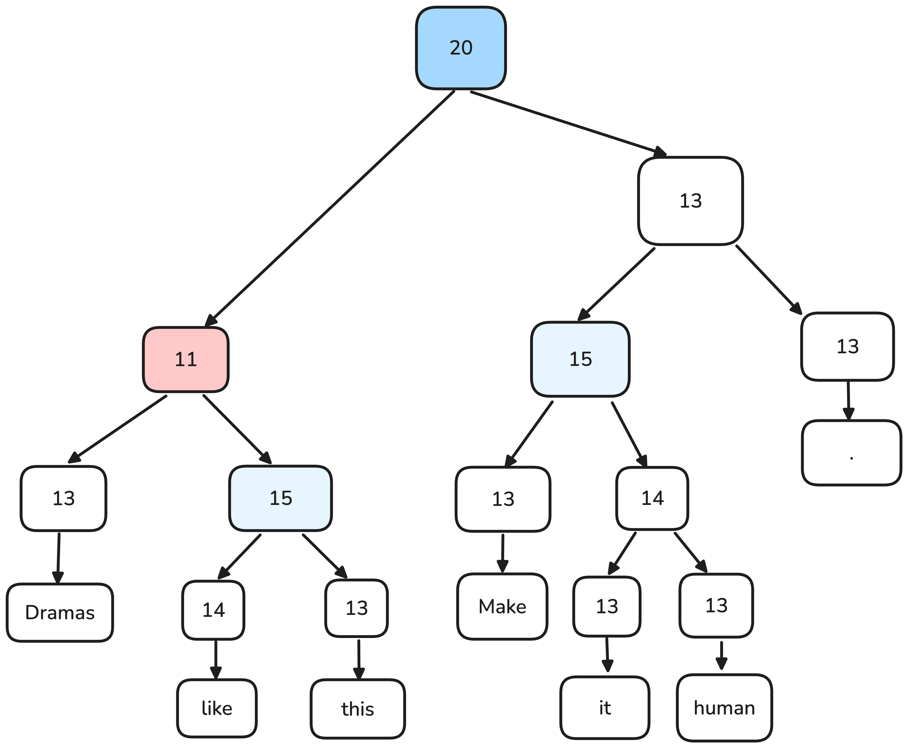
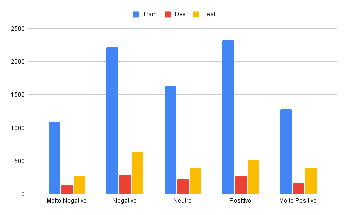

# Comparison of Kernel Methods and Large Language Models in Sentiment Analysis

This repository contains the code produced during the internship of 320 hours at 
University of Padua.

The objective of the project are the following:
- Study the problem of sentiment analysis.
- Reviewing the related scientific literature.
- Implement and compare at least three state-of-the-art models on SST-5.

Most importantly this project aims to investigate the role of syntax and its
compositional properties to understand semantic phenomena, with a particular
focus on sentiment analysis.

# Problem

Sentiment analysis

# Dataset

Stanford Sentiment Treebank

# Dataset

# Dataset

# RNN

| Modello | Accuratezza (%)
| --- | --- |
| RNN | 43.2 |
| RNN con 25 unità nascoste | 39.7 |
| RNN con 50 unità nascoste | 42.4 |
| RNN con 75 unità nascoste | 38.8 |
| RNN con 100 unità nascoste | 39.8 |

# Kernel Method

| Dataset | Accuratezza (%) |
| --- | --- |
| Subtree | 51 |
| Merged | 53 |
| Sentiment | 54 |
| Syntax | 39 |

# Kernel Method

| Modello | Accuratezza(%) |
| --- | --- |
| Subset Tree Sentiment non normalized | 55.2 |
| Subset Tree-bow Sentiment non normalized | 55.2 |
| Partial Tree Sentiment non normalized | 55.2 |

# Large Language Model

| Modello | Accuratezza(%) |
| --- | --- |
| Bert | 52.3 |
| Bert (implementato da me) | 53.2 |
| RoBERTa | 56.4 |
| RoBERTa (implementato da me) | 57.3 |
| DistilBert | 52.0 |

# Comparison

| Modello | Accuratezza(%) |
| --- | --- |
| RNN | 42.4 |
| Kernel Method | 55.2 |
| RoBERTa | 57.3 |
